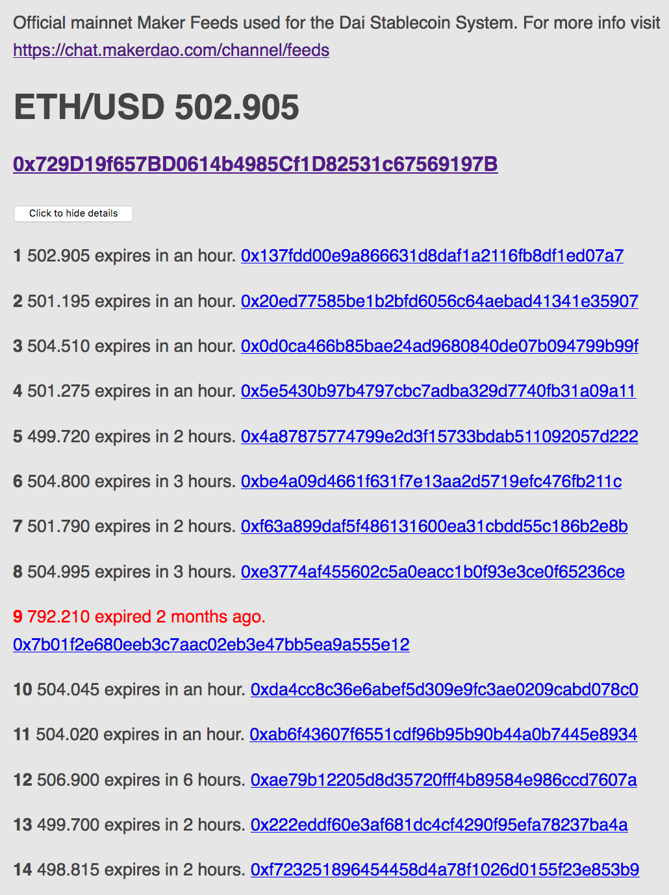
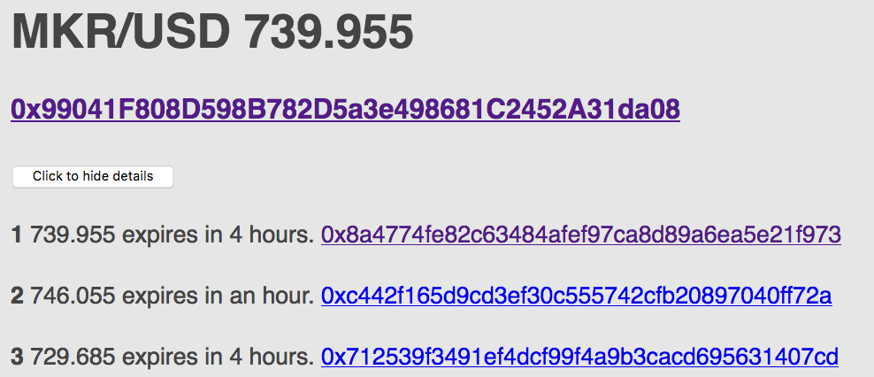

# MakerDAO Feeds

From https://makerdao.com/feeds/ on Apr 17 2017

Source code [https://github.com/makerdao/price-feed/blob/master/src/price-feed.sol](https://github.com/makerdao/price-feed/blob/master/src/price-feed.sol)

## ETH/USD Medianizer-Pip

[0x729D19f657BD0614b4985Cf1D82531c67569197B](https://etherscan.io/address/0x729D19f657BD0614b4985Cf1D82531c67569197B)
* [0x137fdd00e9a866631d8daf1a2116fb8df1ed07a7](https://etherscan.io/address/0x137fdd00e9a866631d8daf1a2116fb8df1ed07a7)
* [0x20ed77585be1b2bfd6056c64aebad41341e35907](https://etherscan.io/address/0x20ed77585be1b2bfd6056c64aebad41341e35907)
* [0x0d0ca466b85bae24ad9680840de07b094799b99f](https://etherscan.io/address/0x0d0ca466b85bae24ad9680840de07b094799b99f)
* [0x5e5430b97b4797cbc7adba329d7740fb31a09a11](https://etherscan.io/address/0x5e5430b97b4797cbc7adba329d7740fb31a09a11)
* [0x4a87875774799e2d3f15733bdab511092057d222](https://etherscan.io/address/0x4a87875774799e2d3f15733bdab511092057d222)
* [0xbe4a09d4661f631f7e13aa2d5719efc476fb211c](https://etherscan.io/address/0xbe4a09d4661f631f7e13aa2d5719efc476fb211c)
* [0xf63a899daf5f486131600ea31cbdd55c186b2e8b](https://etherscan.io/address/0xf63a899daf5f486131600ea31cbdd55c186b2e8b)
* [0xe3774af455602c5a0eacc1b0f93e3ce0f65236ce](https://etherscan.io/address/0xe3774af455602c5a0eacc1b0f93e3ce0f65236ce)
* [0x7b01f2e680eeb3c7aac02eb3e47bb5ea9a555e12](https://etherscan.io/address/0x7b01f2e680eeb3c7aac02eb3e47bb5ea9a555e12) - Expired 2 months ago
* [0xda4cc8c36e6abef5d309e9fc3ae0209cabd078c0](https://etherscan.io/address/0xda4cc8c36e6abef5d309e9fc3ae0209cabd078c0)
* [0xab6f43607f6551cdf96b95b90b44a0b7445e8934](https://etherscan.io/address/0xab6f43607f6551cdf96b95b90b44a0b7445e8934)
* [0xae79b12205d8d35720fff4b89584e986ccd7607a](https://etherscan.io/address/0xae79b12205d8d35720fff4b89584e986ccd7607a)
* [0x222eddf60e3af681dc4cf4290f95efa78237ba4a](https://etherscan.io/address/0x222eddf60e3af681dc4cf4290f95efa78237ba4a)
* [0xf723251896454458d4a78f1026d0155f23e853b9](https://etherscan.io/address/0xf723251896454458d4a78f1026d0155f23e853b9)

 

## MKR/USD Medianizer-Pep

[0x99041F808D598B782D5a3e498681C2452A31da08](https://etherscan.io/address/0x99041F808D598B782D5a3e498681C2452A31da08)
* [0x8a4774fe82c63484afef97ca8d89a6ea5e21f973](https://etherscan.io/address/0x8a4774fe82c63484afef97ca8d89a6ea5e21f973)
* [0xc442f165d9cd3ef30c555742cfb20897040ff72a](https://etherscan.io/address/0xc442f165d9cd3ef30c555742cfb20897040ff72a)
* [0x712539f3491ef4dcf99f4a9b3cacd695631407cd](https://etherscan.io/address/0x712539f3491ef4dcf99f4a9b3cacd695631407cd)

